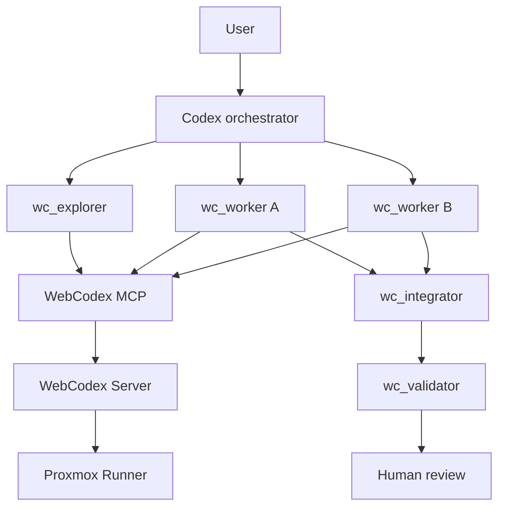
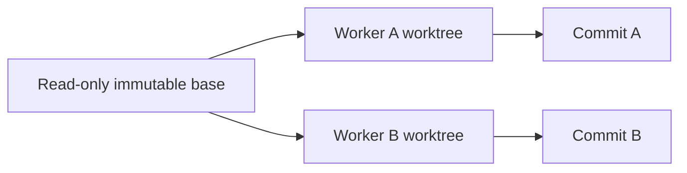
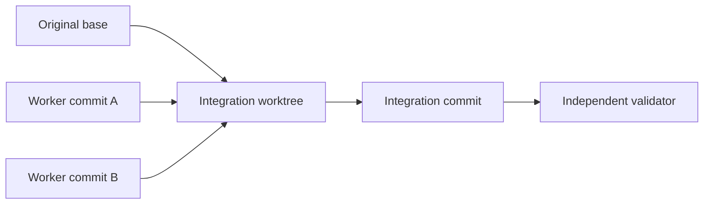
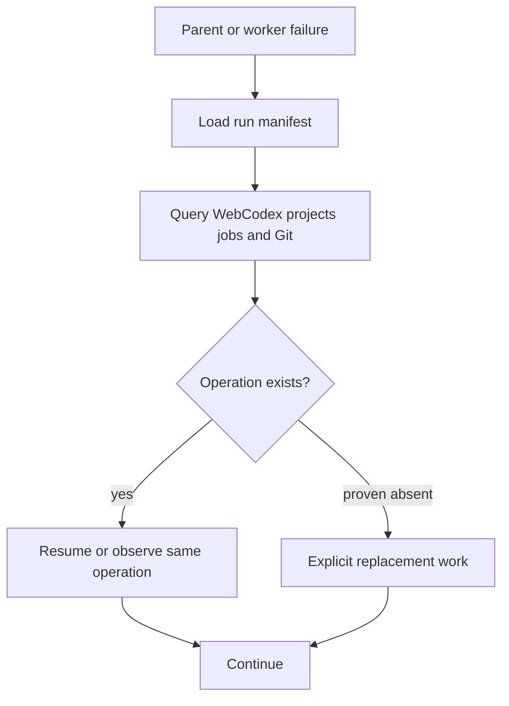

# Codex Multi-Agent over WebCodex

Codex is the orchestration/control plane; WebCodex is the remote execution plane. Codex owns decomposition, spawning, concurrency, dependencies, waiting, reasoning-layer retries, integration decisions and aggregation. WebCodex owns projects, isolated workspaces, edits, Git, processes, validation Jobs and remote execution state.

## Normal execution

## Write-worker isolation

## Integration

## Crash recovery

## Scheduler boundary
V1 does not use WebCodex AgentTask/Durable Agent as a second scheduler because that would duplicate Codex native task ownership. WebCodex durability is used for execution state and Jobs. AgentTask mapping is reserved for a V2 proposal after V1 acceptance.
